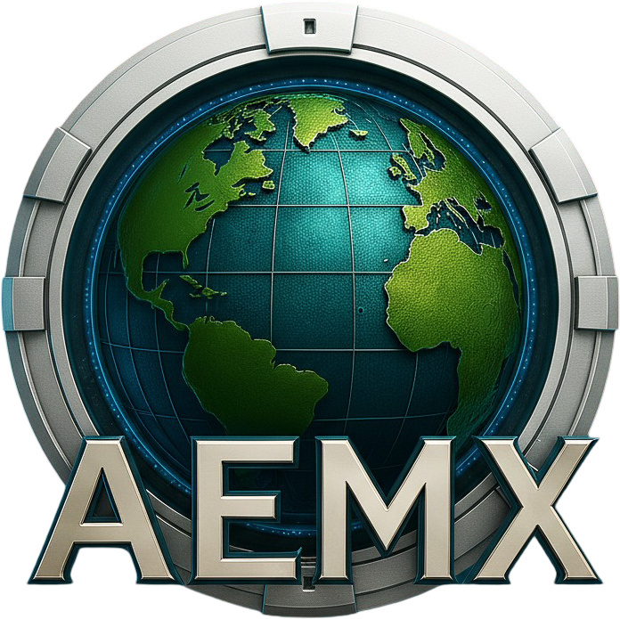

# 🌎 Atlas Earth AEMX — Gamertag Platform V2.0

  

  <strong>Plataforma web del clan Atlas Earth México</strong> 
  Perfiles de jugador · Rankings · Chat · Admin · Coins

  
  
  

---

## 📋 Descripción

**AEMX Gamertag Platform** es una aplicación web estática multi-módulo para los miembros del clan **Atlas Earth México (AEMX)**. Permite gestionar perfiles de jugador, ver rankings en tiempo real, chatear, y administrar el clan, todo desde el navegador sin necesidad de servidor propio.

---

## 🗂️ Módulos

| Archivo | Módulo | Descripción |
|---|---|---|
| `index.html` | **Perfil / GAMERTAG** | Perfil de jugador, medallas, AEMX Coins, exportación PNG |
| `leaderboard.html` | **Ranking** | Clasificación de miembros por parcelas en tiempo real |
| `guias.html` | **Guías** | Documentación y estrategias del juego |
| `chat-firebase.html` | **Chat** | Mensajería grupal en tiempo real |
| `admin.html` | **Admin** | Panel de gestión del clan (solo administradores) |
| `transactions.html` | **Transacciones** | Registro de movimientos de AEMX Coins |
| `editor_marco.html` | **Editor de Marco** | Creador de foto de perfil con marco oficial AEMX |

---

## 🛠️ Stack Tecnológico

- **Frontend:** HTML5, CSS3, JavaScript ES6+ (módulos nativos)
- **Backend:** [Firebase](https://firebase.google.com/) — Auth (Google Sign-In) + Realtime Database
- **Captura de imagen:** [html2canvas](https://html2canvas.hertzen.com/) 1.4.1
- **Tipografías:** Orbitron · Rajdhani · Inter (Google Fonts)
- **Hosting:** GitHub Pages

---

## 🏅 Sistema de Medallas

El perfil de jugador incluye **34 medallas** organizadas en 4 raridades:

| Rareza | Color | Ejemplos |
|---|---|---|
| 🟡 Legendaria | Dorado animado | Fundador, Miembro AEMX, Titán, Leyenda |
| 🟣 Épica | Morado | Tormenta, Guerrero, Imparable |
| 🔵 Rara | Azul | Terrateniente, Urbanista, Magnate |
| 🟢 Común | Verde | Explorador, Mexicano, Ahorrador |

Las medallas se desbloquean automáticamente según los datos del perfil. Algunas medallas legendarias requieren ser **miembro activo del clan** (`clanMember = true`).

---

## 💰 AEMX Coins

Sistema de moneda interna del clan que incentiva la participación. Los coins se acumulan por logros y pueden canjearse por medallas especiales desde la tienda del perfil.

---

## 📁 Archivos de Recursos

| Archivo | Descripción |
|---|---|
| `imagen_1.png` | Ícono/favicon del proyecto |
| `imagen_2.png` | Logo oficial AEMX (usado en medalla y header) |
| `oldaemx.png` | Imagen de la medalla Fundador (con fondo transparente) |

---

## 🔐 Autenticación

Todos los módulos con datos sensibles requieren inicio de sesión con **Google**. El campo `clanMember` en Firebase determina el acceso a funciones exclusivas del clan. El panel de administración requiere adicionalmente el rol de administrador.

---

## 📄 Licencia

Proyecto privado del clan **Atlas Earth México (AEMX)**. Todos los derechos reservados.

---

Hecho con 💙 por el clan AEMX · México 🇲🇽

